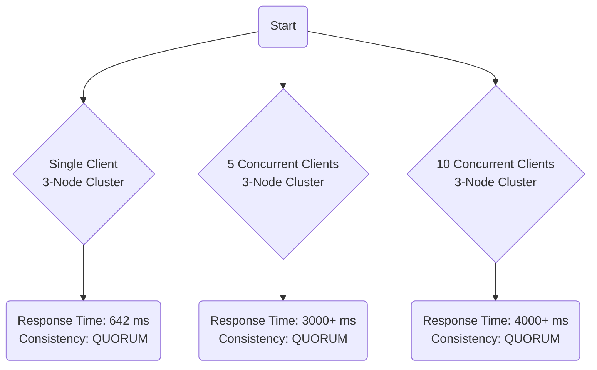

# Assignment Report

## Design

### 1. Data, Domain,& Distribute Database

#### Selections

For this project, [Amazon Customer Reviews](https://www.kaggle.com/datasets/cynthiarempel/amazon-us-customer-reviews-dataset) and [Cassandra](https://cassandra.apache.org/) are selected.  

#### Cassandra

> Apache Cassandra is a database that focuses on reliable performance, speed and scalability. It quickly stores massive amounts of incoming data and can handle hundreds of thousands of writes per second. [source](https://ubuntu.com/blog/apache-cassandra-top-benefits)

#### Amazon Customer Reviews

Data structure can be inspected in `data.tsv` in `/data` folder.

> Amazon Customer Reviews (a.k.a. Product Reviews) is one of Amazon’s iconic products. In a period of over two decades since the first review in 1995, millions of Amazon customers have contributed over a hundred million reviews to express opinions and describe their experiences regarding products on the Amazon.com website. This makes Amazon Customer Reviews a rich source of information for academic researchers in the fields of Natural Language Processing (NLP), Information Retrieval (IR), and Machine Learning (ML), amongst others. [source](https://www.kaggle.com/datasets/cynthiarempel/amazon-us-customer-reviews-dataset)

Dataset directory structure:

```tree
amazon reviews [22G]
├── [3.4G]  amazon_reviews_multilingual_US_v1_00.tsv
├── [1.8G]  amazon_reviews_us_Apparel_v1_00.tsv
├── [1.3G]  amazon_reviews_us_Automotive_v1_00.tsv
...
```

#### Data source & assumption

In the project, since there is no real dataflow from business environment, the data comes from a local disk. Ingestion of data happens on multiple threads.
I assume that, in a real business environment, dataflow is dynamic and comes from millions of users that operate on the platform concurrently.  

Situations/assumptions where the platform serves for big data workload:

1. Batch data are ingested for model training or business analysis.
2. Reading and recording millions customers' reviews synchronously.
3. Data backup/migration.

#### Reasons for selecting Amazon Reviews

1. Its big enough(more than 22GB) to demonstrate the workflow of a big data platform.
2. The dataset contains multiple columns (with various data types) and is rather clean and standardized so that it don't need excessive data cleaning.
3. Semantically, the dataset is useful in many domains, e.g. Large Language Model (LLM) trainning, business analysis, etc.

#### Reasons for selecting Cassandra

1. Cassandra is highly scalable and one can increase performance just by adding a new rack.
2. There is no “master” that needs to be super-sized to handle orchestrating and managing data, more economical.
3. Data can be quickly replicated across the entire system, regardless of geographic location. It ensures data integrity.
4. If a particular node fails, users will be automatically moved to the closest working node.

#### Data types

Data types majorly contains `INTEGER`, `TEXT`. Specially, `review_date` will be converted to `Date` type in the database.

```shell
marketplace: <class 'str'>
customer_id: <class 'int'>
product_id: <class 'str'>
product_parent: <class 'int'>
product_title: <class 'str'>
product_category: <class 'str'>
star_rating: <class 'int'>
helpful_votes: <class 'int'>
total_votes: <class 'int'>
vine: <class 'int'>
verified_purchase: <class 'str'>
review_headline: <class 'str'>
review_body: <class 'str'>
review_date: <class 'str'>
```

### 2. Platform Architecture & Data Ingestion explain

### 3. Cluster configuration

You can inspect the configuration file [here](https://github.com/James-Leste/Big-Data-Platform-2024/blob/main/code/cassandra-compose.yml). The cluster consists of 3 cassandra nodes. node2 and node3 will always restart when node1 is healthy. If one node dies, other nodes still have the data that can be accessed.  
Ways to prevent SPof

1. To prevent SPoF, nodes should be distributed across multiple data centers. This distribution ensures that even if one data center goes down, the others can continue to serve requests.  

2. The configuration uses a `service_healthy` condition for `depends_on`, which is good for ensuring that dependent services wait for the Cassandra node to be fully up and healthy before starting.


### 4. 

Replication Factor: A common choice for replication factor in a production environment is three. This means each piece of data is stored on three different nodes. This level of replication provides a good balance between redundancy (for fault tolerance) and resource usage.

Number of Nodes: With a replication factor of three, you would need at least three nodes to ensure that each piece of data is stored on a different node. However, to truly safeguard against a single-point-of-failure and allow for maintenance or unexpected outages without losing data availability, it's advisable to have more than three nodes. For instance, having at least three nodes per data center if using multiple data centers would be a good start.

Considerations for Node Failure: With a replication factor of three, the cluster can tolerate the failure of up to two nodes (in the simplest case where data is evenly distributed and no more than one replica of any data piece is on the failing nodes) before data becomes inaccessible. However, the actual tolerance to node failures can be more complex and depends on factors such as data distribution, consistency levels in use, and specific queries being executed.

#### 5. 

## Implementation

### 1. Data Schema

The data only have one structure. Two schema were designed to achieve different businees requirements.

#### Queries by `review_id`

```sql
CREATE TABLE IF NOT EXISTS reviews_by_id (
    marketplace text,
    customer_id int,
    review_id text,
    product_id text,
    product_parent int,
    product_title text,
    product_category text,
    star_rating int,
    helpful_votes int,
    total_votes int,
    vine text,
    verified_purchase text,
    review_headline text,
    review_body text,
    review_date date,
    PRIMARY KEY (review_id)
);
```

#### Queries by `customer_id`

In this table, `customer_id` is the partition key, and `review_id` is the clustering column. This setup allows users to query all reviews by a specific customer and orders them by review_id.

```sql
CREATE TABLE reviews_by_customer_id (
    customer_id INT,
    review_id TEXT,
    marketplace TEXT,
    product_id TEXT,
    product_parent INT,
    product_title TEXT,
    product_category TEXT,
    star_rating INT,
    helpful_votes INT,
    total_votes INT,
    vine INT,
    verified_purchase TEXT,
    review_headline TEXT,
    review_body TEXT,
    review_date DATE,
    PRIMARY KEY (customer_id, review_id)
) WITH CLUSTERING ORDER BY (review_id DESC);
```

### 2. Partition and Clustering Strategies

#### Keyspace definition

The NetworkTopologyStrategy is chosen for multi-datacenter environments because it allows specifying the number of replicas in each datacenter.

```sql
CREATE KEYSPACE reviews_keyspace 
    WITH REPLICATION = {
        'class' : 'NetworkTopologyStrategy',
        'DC1' : 2,
        'DC2' : 1
};
```

However, with only three nodes across two datacenters, full fault tolerance can't be achieved for both datacenters if one datacenter completely fails. This would be addressed when I have more computing resources.

#### Data Partitioning and Table Design

In table `reviews_by_customer_id`

- `product_id` is the partition key, which means that all reviews for a specific product will be stored together on the same node, enhancing the performance of queries that retrieve all reviews for a particular product.  
- `review_id` is the clustering column, which ensures that within a partition, reviews are sorted by their UUIDs. This can be useful for querying the latest or oldest reviews for a product.

### 3. Data Ingestion

Run `/code/mysimbdp-dataingest.py` to ingest the data to the Cassandra cluster which is running locally or on a Google Cloud VM. Atomic data element/unit for ingesting is a datarow.  
In Cassandra, consistency levels determine the number of replicas on which a write operation must be acknowledged before considering the operation successful. When using Cassandra within Docker, the consistency options for writing data remain the same as in any standard Cassandra deployment.

#### Consistency Options

- `QUORUM`: The write must be acknowledged by a majority of the replica nodes in the cluster
- `LOCAL_QUORUM`: The write must be acknowledged by a majority of the nodes in the local datacenter.
- `EACH_QUORUM`: The write must be acknowledged by a quorum of the nodes in each datacenter.

### 4. Response Time Comparison



### 5. 

## Source code structure

- `cassandra-compose.yml`: contains cassandra cluster docker image configuration.
- `connector.py`: contains `createKeyspace()`, `initDatabase()` and `initinitConnection()` functions for database connection.
- `mysimbdp-dataingest.py`: contains `ingesting()` for data ingestion.
- `requirements.txt`: contains python package requirements.
